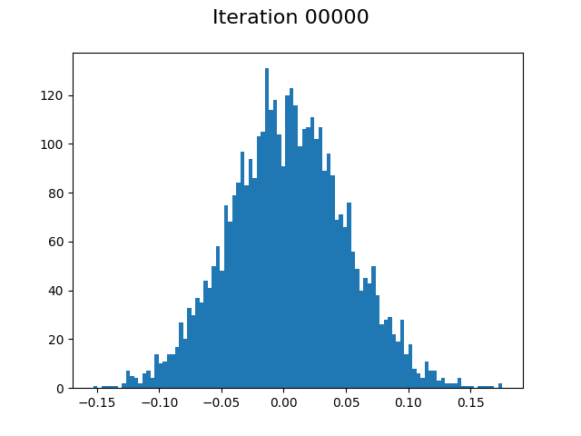

# Neural Probability Distribution Sampler
*A neural network to sample from any probability distribution, such as the exponential distribution.*

The major requirement is to have a sufficiently larger number of realizations, drawn from the target distribution.

The neural sampler is controlled by only one parameter: the seed. It controls the randomness in the generation. For two identical seeds, the generated realizations should match exactly.

NB: This first implementation restricts the sampling to univariate random variables.

  
   <i>Normal Distribution -> Exponential Distribution (during training phase)</i>

